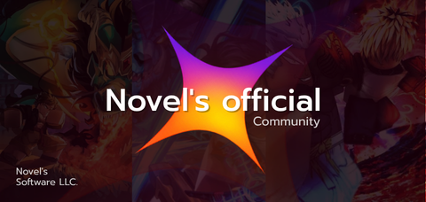

<div align="center">



# Novel

**Simple Roblox automation. Fast, stable, and easy to use.**

[](https://github.com/vita8it/Novel)
[](https://www.roblox.com/)

</div>

---

## About

**Novel** is a simple and lightweight Roblox automation hub focused on
**faster, stability, and ease of use.**

## Features

| Feature                                                                    | Description                       |
| :------------------------------------------------------------------------- | :-------------------------------- |
|        | Fast execution                    |
|    | Stable automation                 |
|    | Simple and easy-to-use options    |

## Installation

```lua
loadstring(game:HttpGet("https://raw.githubusercontent.com/vita8it/Novel/main/main.luau"))()
```

## Supported Games

- Steal a Egg
